<div align="center">
Este juego fue creado enteramente con IA para probar las capacidades de Astra.

# El Cuartico: ¡Estamos grabando!

**Tres personajes. Seis misiones. Dos episodios por publicar.**

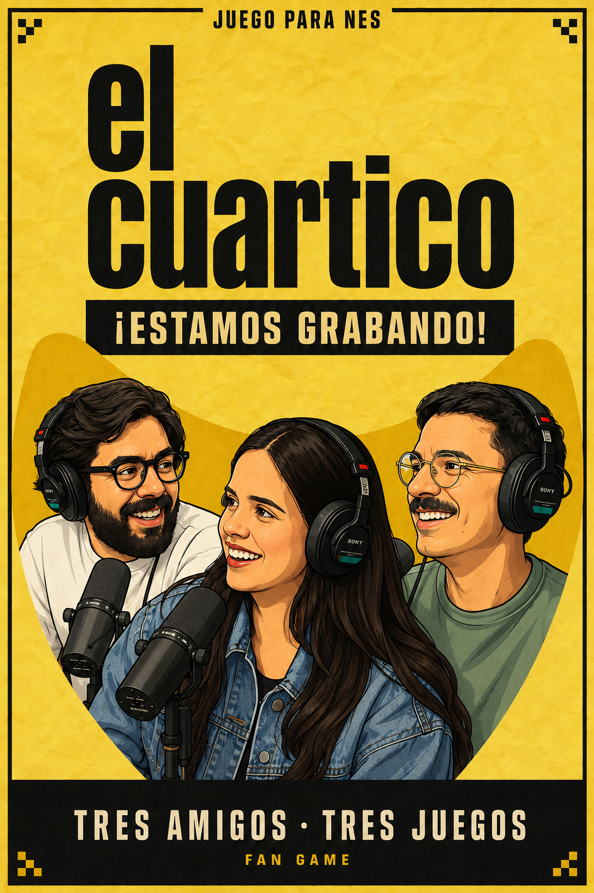

**NES · MMC5 · Un jugador · v0.13.0**

[🎮 Descargar ROM](dist/el-cuartico-v0.13.0-mmc5.nes?raw=1) · [Cómo jugar](#cómo-jugar) · [Compilar](#compilar-el-juego) · [Desarrollo](docs/DESARROLLO.md)

</div>

Un juego *homebrew* inspirado en **El Cuartico**, hecho para jugarse en emuladores
de NES. Elige a **Chucho, Estefania o Daniel** y completa sus desafíos en el orden
que quieras dentro de cada episodio. Cada victoria deja un sello; consigue los tres
para cerrar la primera grabación y pulsa **A** para continuar con el episodio en directo.
La campaña reúne seis misiones y conserva los puntos entre los dos episodios.

## Nuevos arreglos musicales · v0.13.0

El menú usa una frase corta de **elcuartico_song_2**: cuatro compases que se repiten
cada 9,6 segundos aproximadamente. **elcuartico_song_3** da la melodía de Estefania
en ambos episodios, adaptada a los 120 BPM de sus notas. Cada acto entra en un
compás diferente del arreglo de ocho segundos.

[Partitura y detalles](docs/MUSICA-REFERENCIAS.md)

La ROM sintetiza melodía, bajo y percusión con la
APU de NES; el segundo canal de pulso queda disponible para los efectos del juego.

## Texto más claro en pantallas pequeñas · v0.12.2

A partir de las fotos de una R36S, el menú, la ayuda, la pausa y los resultados
usan letras más pequeñas, de trazo simple y con más aire dentro de cada casilla.
Las instrucciones de Estefania separan el momento de pulsar de la acción.

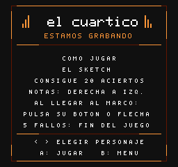

[Detalle y capturas de la revisión](docs/LEGIBILIDAD-R36S.md).

## Entradas y controles v0.12.1

**Chuchito el Rufián** y **The Lion Queen** tienen su propia pantalla de entrada,
junto a **¿Dónde está Dany?**. A o Start comienza y B vuelve al menú; el reloj
espera en las tres tarjetas.

| Chuchito el Rufián | The Lion Queen | Salidas del barrio |
| :---: | :---: | :---: |
| 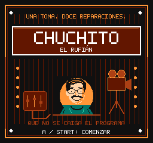 | 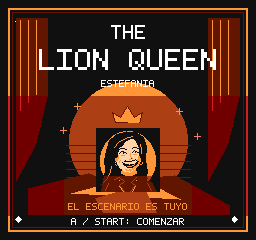 | 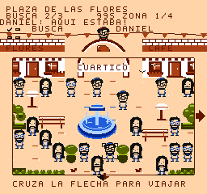 |

La ayuda cambia de personaje sin parpadeos ni texto a medio dibujar. Estefania
explica cómo pulsar cada símbolo al llegar al marco izquierdo. Al acabar un acto
solo entran las notas que faltan para completarlo; el último acierto deja la pista
vacía. Si fallas la última nota, aparece una de reemplazo.

[Capturas, controles y comprobaciones](docs/ENTRADAS-CONTROLES.md).

## Episodio 2 · En directo

La segunda grabación tiene una misión nueva para cada personaje. Puedes elegir
su orden, consultar la ayuda y volver al estudio entre intentos.

| Personaje | Nueva misión |
| --- | --- |
| **Chucho** | Restablece energía, cámara y mezcla; reinicia la señal para cerrar cada uno de los tres enlaces. Tú eliges el orden de cámara y mezcladora. |
| **Estefania** | Completa una rutina de 49 aciertos con notas sostenidas y tres composiciones nuevas. Mantén las notas con cola hasta que termine su barra. |
| **Daniel** | Encuéntralo en tres mundos más poblados. Hay dos objetos opcionales por mundo: un micrófono y un guion. Cada uno da una pista, 150 puntos y hasta diez segundos. |

| Enlaces del directo | Notas sostenidas | Objetos del barrio |
| :---: | :---: | :---: |
| 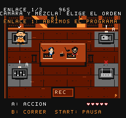 | 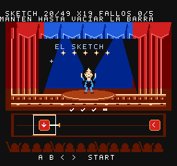 | 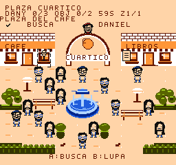 |

Cada misión comienza con una tarjeta sin reloj. Si pausas durante una nota
sostenida, al volver el juego espera a que retomes su botón. Los objetos de Daniel
son opcionales y permanecen recogidos al volver a su zona.

**Remix se abre al terminar ambos episodios.** El progreso vive en la sesión:
esta versión no añade guardado.

[Guía del segundo episodio y validación](docs/SEGUNDO-EPISODIO.md).

## Presentación v0.11.0

La nueva presentación reúne los controles, la pausa y los resultados bajo la
misma identidad visual del programa. El menú muestra el avance de los sellos
del episodio y ofrece ayuda antes de entrar a cada juego.

- **Ayuda opcional:** pulsa arriba en la selección; izquierda/derecha cambia de
  personaje, A o Start juega y B vuelve al menú.
- **Pausa completa:** Start abre una pantalla con continuar, reintentar y volver
  al menú. Select muestra los controles del juego o del panel de reparación activo.
- **Resultados claros:** puntos de la toma, objetivo alcanzado, errores,
  medallas y sellos del episodio. Una derrota explica qué terminó el intento.
- **Señales durante el juego:** Chucho muestra la acción de la estación cercana;
  Estefania distingue la práctica de la cuenta de entrada.

[Ver capturas y probar la presentación](docs/PULIDO-PRESENTACION.md).

## El estudio y los desafíos

[Ver la intro y los retratos](docs/INTRO-RETRATOS.md).
[Ver los cambios visuales](docs/DANIEL-ARTE.md).
[Guía del episodio remix](docs/PRUEBA-REMIX.md).

- **Reacciones:** mensajes breves de los personajes y celebración al reparar.
- **Chucho:** apagón, acople y grabación en directo, en orden variable. Resolver
  la estación indicada da 200 puntos y recupera un corazón si te falta alguno.
- **Puzles:** más combinaciones de cables y objetivos de enfoque variables.
- **Estefania:** calentamiento, pasito y remate, con música y luces propias.
- **Daniel:** mercado, paseo musical, jardín, patio de arte y calle de flores,
  con caminos reflejados y puntos de referencia distintos.
- **Estudio compartido:** pulsa B en la selección, camina hasta un personaje y
  pulsa A. B vuelve al menú de retratos.
- **Medallas y final:** las tomas limpias conservan su medalla en el menú;
  seis tomas perfectas tienen un reconocimiento en el cierre. B anima la fiesta.
- **Remix:** después de terminar ambos episodios, A inicia otra campaña con más
  señuelos y variantes. Start comienza una campaña normal.

| El estudio compartido | Tres actos musicales | Fiesta del episodio |
| :---: | :---: | :---: |
| 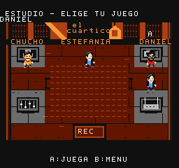 | 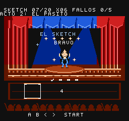 | 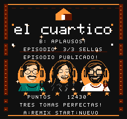 |

## Un vistazo al juego

| Elige tu personaje | Sigue el ritmo | Encuentra a Daniel |
| :---: | :---: | :---: |
| 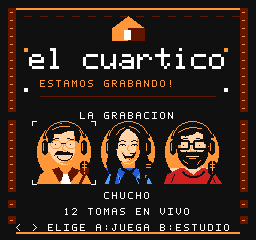 | 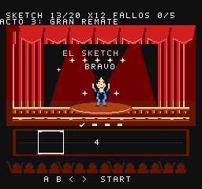 |  |

| Conecta los cables | Atrapa la señal | Recuerda la secuencia |
| :---: | :---: | :---: |
| 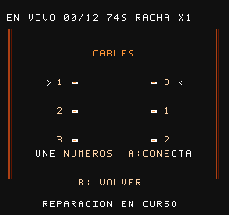 | 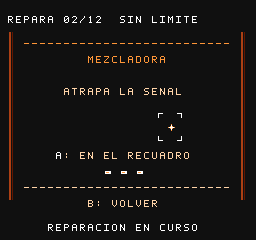 | 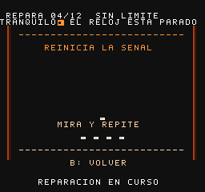 |

## Jugar ahora

1. Descarga [**el-cuartico-v0.13.0-mmc5.nes**](dist/el-cuartico-v0.13.0-mmc5.nes?raw=1).
2. Ábrelo en un emulador con soporte **MMC5**, como FCEUmm o Mesen.
3. Usa el **control 1**, región **NTSC** y velocidad normal. No hace falta BIOS.

Al actualizar, inicia desde cero: los estados guardados de una ROM anterior no
son compatibles con esta versión. La música y los gráficos están dentro del archivo.

En [dist/](dist/) solo se conserva la entrega actual: la ROM, las instrucciones
breves y su [checksum SHA-256](dist/SHA256.txt).

### En R36S o Retroid

- **R36S con ArkOS:** apaga la consola, copia la ROM a la carpeta `nes` de la tarjeta
  de juegos, expulsa la tarjeta de forma segura y abre el juego en la lista de NES.
- **Retroid:** copia la ROM a tu carpeta de juegos y ábrela en RetroArch con el núcleo
  FCEUmm. Si no aparece al escanear, usa **Cargar contenido** y selecciona el archivo.
- Si A y B están intercambiados, ajusta el mapeo del control 1. Para el juego de ritmo,
  usa altavoces o auriculares con cable y desactiva la aceleración y el turbo.

La versión actual se prueba en FCEUmm y Mesen de escritorio. Una versión anterior
fue probada en R36S; la entrega actual todavía necesita validación en la consola.

## Cómo jugar

Estas reglas describen el **episodio 1**. El [episodio 2](docs/SEGUNDO-EPISODIO.md)
conserva los controles básicos y añade sus propias misiones.

### Chucho · Mantén el estudio funcionando

La tarjeta **Chuchito el Rufián** abre el desafío; confirma con A o Start.
Completa **12 reparaciones**, con **75 segundos iniciales** y **cinco corazones**.
Muévete por el estudio, acércate a una estación averiada y pulsa **A** para abrir
su minijuego. **B** permite correr cuando el indicador está listo.

| Estación | Reparación | Qué hacer |
| --- | --- | --- |
| Arriba a la izquierda | Cables | Usa arriba/abajo para elegir el terminal derecho y pulsa A para unir el número indicado. Completa tres conexiones. |
| Arriba a la derecha | Enfoque | Mueve la estrella con izquierda/derecha hasta el recuadro y confirma con A. Ajusta dos objetivos. |
| Abajo a la izquierda | Atrapa la señal | Pulsa A cuando la estrella pase por el recuadro. Necesitas tres aciertos; el objetivo cambia de posición después de cada uno. |
| Abajo a la derecha | Memoria | Observa cuatro direcciones y repítelas con la cruceta. Cada flecha se muestra durante un segundo, con pausas entre ellas. |

**B cierra el panel** sin reparar la estación. Los errores tienen respuesta visual,
pero no quitan corazones. Dentro de los minijuegos aparece **SIN LÍMITE**: tanto
el reloj del episodio como los plazos de las otras averías quedan congelados.
Tómate el tiempo que necesites; el reloj solo corre cuando vuelves al estudio.

Después de las reparaciones 3, 6 y 9 aparece un evento. Atiende la estación
indicada en la franja superior para conseguir su premio; los eventos mantienen
la pausa del reloj dentro del panel. El apagón cambia la luz del estudio y el
acople desafina el monitor hasta que reparas los cables.

Cada cuarta reparación añade **tres segundos**. Encadenar reparaciones aumenta el
multiplicador de puntos. Dejar vencer una avería en el estudio cuesta un corazón.

### Estefania · El sketch

La entrada **The Lion Queen** presenta a Estefania. Confirma con A o Start.
Las notas viajan de derecha a izquierda: pulsa **A, B o la dirección indicada**
cuando ese símbolo llegue al recuadro de la izquierda.
La primera A es una práctica sin tiempo; después hay una cuenta de cuatro tiempos.
Consigue **20 aciertos** antes de acumular cinco fallos. Al alcanzar 7 y 13 aciertos
cambian la música, las luces y el patrón de notas. Cada acto vuelve a contar cuatro
tiempos. Antes de cada cierre dejan de entrar notas sobrantes: completa las
que están en pantalla. Un fallo permite una nota de reemplazo. La rutina termina
por aciertos o por cinco fallos; no tiene un reloj de cuenta atrás.

Los aciertos precisos dan puntos extra, y cada cinco aciertos consecutivos de la
secuencia añaden otros 100 puntos. La música y las notas se detienen juntas al pausar.

### Daniel · ¿Dónde está Daniel?

La tarjeta **¿Dónde está Dany?** abre el juego. Pulsa **A o Start** para comenzar,
o **B** para volver al menú. El reloj espera mientras ves la intro.

Explora la plaza y compara las caras con el retrato de referencia. Hay un solo
Daniel en cada mundo, y las personas mantienen su posición cuando vuelves a una zona.

| Búsqueda | Tamaño del mundo | Personas | Tiempo inicial |
| --- | --- | --- | --- |
| Plaza | Una zona | 12 | 60 segundos |
| Mercado | Dos zonas contiguas | 32 | 85 segundos |
| Barrio | Cuatro zonas, en una cuadrícula de 2 × 2 | 80 | 99 segundos |

- **Cruceta:** mueve el cursor. Sigue la flecha situada en el borde izquierdo,
  derecho, superior o inferior para pasar a otra zona; el mapa pequeño marca dónde estás y qué zonas visitaste.
- **Mantener B:** abre la lupa sobre una persona y permite moverte con precisión.
  Suelta B para cruzar a otra zona.
- **A:** elige a la persona enfocada. Equivocarte cuesta **cinco segundos**.

Las flechas ocupan franjas despejadas alrededor del escenario y solo aparecen
donde hay una zona conectada. Los pájaros se ocultan
al usar la lupa. Encuentra a Daniel una vez en cada mundo para conseguir su sello.

### Pausa y progreso

| Situación | Controles |
| --- | --- |
| Selección | Izquierda/derecha o Select para elegir; A o Start para empezar. |
| Entrada de un personaje | A o Start confirma; B vuelve al menú. El reloj espera. |
| Durante un juego | Start pausa. |
| En pausa | Start continúa, A reinicia el intento, B vuelve a la selección y Select abre los controles. |
| Controles durante la pausa | Select o B vuelve a la pausa; Start continúa el juego. |
| Ayuda desde la selección | Arriba abre la ayuda; izquierda/derecha cambia de personaje; A o Start juega; B vuelve. |
| Estudio compartido | Cruceta para caminar, A junto a un personaje, B para volver al menú. |
| Final del episodio 1 | A continúa al episodio 2; B anima la fiesta y Start comienza una campaña normal. |
| Final del episodio 2 | A comienza Remix; B anima la fiesta y Start comienza una campaña normal. |

La pausa congela el reloj, la música y los puzles. Al continuar recuperas la misma
plaza o panel, con sus personas, colores y progreso. Consultar los controles
durante la pausa tampoco consume tiempo.

Los sellos de victoria duran la sesión actual y se conservan al reintentar otro
juego. Al pasar al segundo episodio empiezas sus tres sellos; los puntos y las
medallas del primero siguen contando para el cierre de la campaña. Las medallas son opcionales: tres por una partida sin errores; dos si no
superas dos fallos ni dos errores de reparación; una por las demás victorias.
Equivocarte dentro de un panel no quita corazones, pero cuenta para esa medalla.

En **Remix**, el enfoque pide tres confirmaciones y la mezcladora cuatro aciertos.
Estefania usa otras combinaciones de botones, y Daniel tiene 16, 40 y 96 personas
repartidas entre uno, dos y cuatro lugares. Se conservan los tiempos normales,
la velocidad pausada de memoria y los paneles sin límite.

No hay guardado por batería. Usa estados del emulador únicamente con la
misma versión de la ROM y el mismo núcleo.

## Compilar el juego

La ruta de desarrollo preparada es **Windows + PowerShell**, con Python 3.10 o
superior, Pillow y cc65. El script de instalación descarga las herramientas en
`tools/`; esos binarios no se incluyen en Git.

```powershell
git clone https://github.com/Reston/el-cuartico-nes.git
cd el-cuartico-nes
python -m pip install -r requirements.txt
python tools/bootstrap.py
./build.ps1
python tools/package.py
```

La compilación genera `build/el-cuartico.nes`. El empaquetador copia esa ROM a
`dist/` con la versión de [VERSION](VERSION) y actualiza `SHA256.txt`.

### Ejecutar las pruebas

```powershell
python tools/bootstrap.py --test-tools
./build.ps1
python tools/test_all.py --mesen
```

Las pruebas usan entradas de control en FCEUmm y campañas independientes en Mesen.
Comprueban los seis órdenes de juego, victorias y derrotas, pausa, ritmo, selección,
los cuatro paneles de reparación, navegación, límites de sprites y tiempos de cuadro.
También recorren ambos episodios, las dependencias del directo, las notas sostenidas,
la recuperación tras pausa y los objetos opcionales, incluida una campaña Remix completa.
También se compara cada cuadro de los cambios rápidos de ayuda, las tres tarjetas,
las flechas en cada zona y el cierre de notas con fallos recuperables.
Los informes, capturas y grabaciones se guardan en `build/`, fuera del control de versiones.

## Estructura del proyecto

```text
src/              Código C, arranque 6502, música y configuración del cartucho
assets/           Arte nativo por tiles, generadores y gráficos del juego
tools/           Compilación auxiliar, emuladores de prueba y validación
docs/            Documentación y capturas para este repositorio
dist/            Solo la última ROM, instrucciones y checksum
build/           Resultados locales de compilación y pruebas; ignorados por Git
```

Los intentos anteriores y los materiales de trabajo se archivan **fuera del
repositorio**. No forman parte de `dist/` ni de la descarga del código.

## Créditos y licencia

Proyecto fan no oficial inspirado en **El Cuartico** y sus personajes. El arte de
los personajes toma como referencia las fotografías compartidas durante el desarrollo.
El juego incluye gráficos por tiles y música para la APU de NES. Los arreglos
del menú y de Estefania parten de las dos grabaciones aportadas por el usuario.

Herramientas: [cc65](https://github.com/cc65/cc65),
[FCEUmm](https://github.com/libretro/libretro-fceumm),
[Mesen CE](https://github.com/nesdev-org/MesenCE) y
[Pillow](https://github.com/python-pillow/Pillow).

Se conserva la licencia **GNU GPL v3** del repositorio. Consulta [LICENSE](LICENSE).
