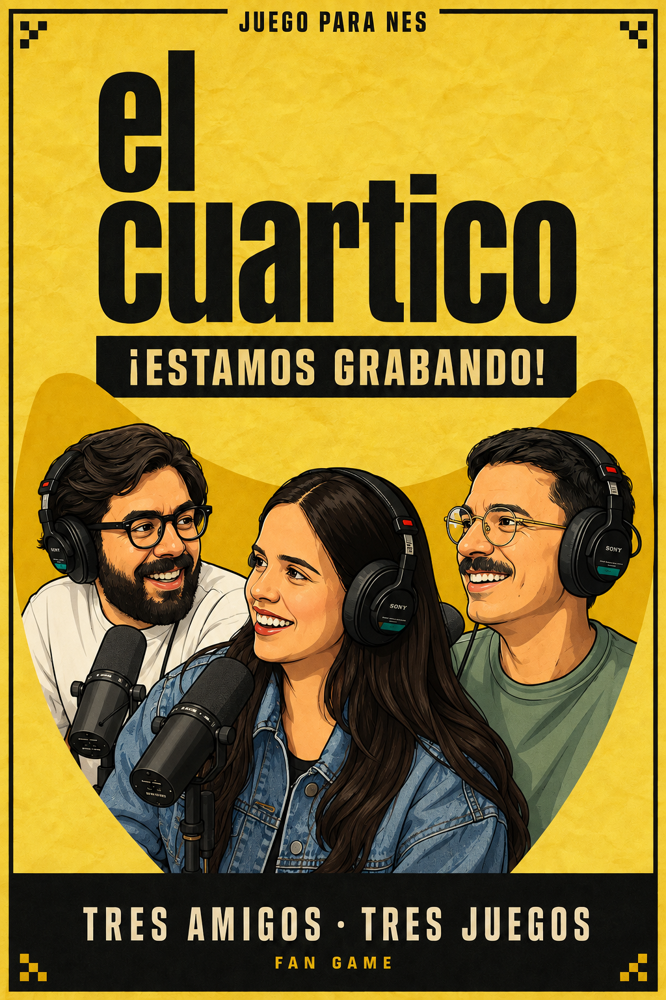
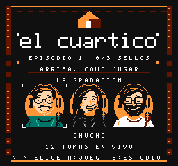

<div align="center">

# El Cuartico: ¡Estamos grabando!

Este juego fue creado enteramente con IA para probar las capacidades de Astra.



**NES · Un jugador · v0.13.1**

[🎮 Descargar ROM](https://raw.githubusercontent.com/Reston/el-cuartico-nes/main/dist/el-cuartico-v0.13.1-mmc5.nes) · [Cómo jugar](docs/COMO-JUGAR.md) · [Desarrollo](docs/DESARROLLO.md)

</div>

Un juego inspirado en **El Cuartico**: elige a Chucho, Estefania o Daniel y
completa seis misiones repartidas en dos episodios.

## Jugar

Descarga la ROM con el enlace de arriba y ábrela en un emulador de NES con soporte
**MMC5**, como FCEUmm o Mesen. Usa el control 1, región NTSC y velocidad normal;
no hace falta BIOS.

En **R36S con ArkOS**, copia el archivo `.nes` a la carpeta `nes` de la tarjeta
de juegos con la consola apagada. Expulsa la tarjeta de forma segura y abre el
juego desde la lista de NES.

Al actualizar, inicia una partida nueva. No cargues estados de una versión anterior.
[Instrucciones breves](dist/LEEME.txt) · [Checksum SHA-256](dist/SHA256.txt).

## Los juegos

| Personaje | Desafío |
| --- | --- |
| **Chucho** | Repara el estudio con puzles de cables, enfoque, mezcla y memoria. |
| **Estefania** | Pulsa el botón o la dirección indicada cuando la nota llegue al marco. |
| **Daniel** | Explora los barrios, usa la lupa y encuentra su cara entre la multitud. |

Consigue los tres sellos y pulsa **A** para continuar al segundo episodio.
Al completar ambos se desbloquea **Remix**. El progreso dura la sesión; no hay guardado por batería.



## Controles

| Acción | Botón |
| --- | --- |
| Elegir personaje | Izquierda/derecha o Select |
| Empezar o confirmar | A o Start |
| Ver la ayuda desde el menú | Arriba |
| Entrar al estudio desde el menú | B |
| Pausar o continuar | Start |
| Ver los controles durante la pausa | Select |

[Guía completa](docs/COMO-JUGAR.md) · [Segundo episodio](docs/SEGUNDO-EPISODIO.md).

## Compilar

En Windows con PowerShell y Python 3.10 o superior, desde la carpeta del proyecto:

```powershell
python -m pip install -r requirements.txt
python tools/bootstrap.py
./build.ps1
```

La ROM se genera en `build/el-cuartico.nes`.
[Arquitectura, pruebas y publicación](docs/DESARROLLO.md).

## Créditos y licencia

Proyecto fan no oficial inspirado en El Cuartico. Las fotografías y las referencias
musicales fueron aportadas por el usuario durante el desarrollo.

Hecho con [cc65](https://github.com/cc65/cc65) y
[Pillow](https://github.com/python-pillow/Pillow); probado en
[FCEUmm](https://github.com/libretro/libretro-fceumm) y
[Mesen CE](https://github.com/nesdev-org/MesenCE).

[Licencia GNU GPL v3](LICENSE).
