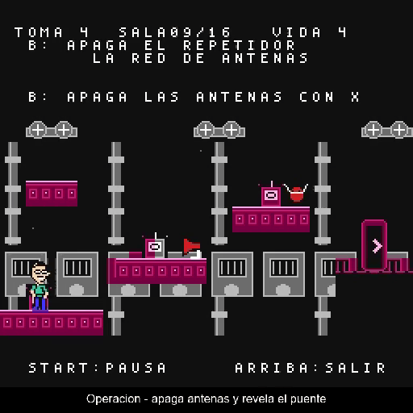

<div align="center">

# El Cuartico: Una última toma

Este juego fue creado enteramente con IA para probar las capacidades de Astra.

**NES · Un jugador · v0.15.0**

[🎮 Descargar ROM](https://raw.githubusercontent.com/Reston/el-cuartico-nes/main/dist/el-cuartico-v0.15.0-mmc5.nes) · [Cómo jugar](docs/AVENTURA.md) · [Desarrollo](docs/DESARROLLO.md)

</div>

Chucho, Estefania y Daniel intentan planificar un sketch para el videojuego.
Cada propuesta se convierte en una parodia jugable: escaladas con demasiada
protección, robots que repiten rumores y pistas que Daniel supuestamente debería entender.

- **132 salas**, tres historias principales de dos tomas y un cierre jugable.
- Apaga la fábrica del rumor; explora tres rutas y resuelve las pistas de la leyenda.
- **Dos capítulos extra** con Nadia, Alí y los apodos que se vuelven literales.
- Tres personajes, cinco jefes, ocho cintas opcionales y medallas por jugar sin daño.
- Reintentos sin límite, ayuda opcional y progreso recuperable con contraseña.
- Los tres minijuegos originales se integran como ensayos breves; la colección
  completa de dos episodios y Remix sigue en **Juegos del estudio**.

[](docs/media/aventura-capitulos-v0.15.0.mp4)

[Ver gameplay de los capítulos ampliados](docs/media/aventura-capitulos-v0.15.0.mp4).

## Jugar

Abre la ROM en un emulador de NES con **MMC5**, como FCEUmm o Mesen.
Control 1, NTSC y velocidad normal; no hace falta BIOS.

En **R36S con ArkOS**, copia el `.nes` a la carpeta `nes` de la tarjeta de juegos
con la consola apagada. Expulsa la tarjeta de forma segura y abre el juego desde NES.
Inicia desde cero al actualizar; evita estados del emulador de versiones anteriores.
La prueba física de esta versión en R36S sigue pendiente.

| En la aventura | Botón |
| --- | --- |
| Moverse | Izquierda/derecha |
| Saltar; mantener para subir más | A |
| Golpear, disparar o desviar proyectiles | B |
| Activar una claqueta, leer una pista o salir | Arriba |
| Pausa, ayuda y dificultad | Start |
| Mapa y libreta en la leyenda | Select |
| Volver a la plaza desde el inicio de una ruta | Abajo |
| Cambiar actor en la mesa o selector de rutas | Select |
| Ver la contraseña desde la mesa | Start |

Anota la contraseña antes de apagar: conserva tomas, cintas, medallas, ensayos y
dificultad; reanuda en la mesa de ideas. La colección clásica conserva su progreso
solo durante la sesión.

[Guía de aventura](docs/AVENTURA.md) · [Minijuegos clásicos](docs/COMO-JUGAR.md) · [Instrucciones de la ROM](dist/LEEME.txt) · [SHA-256](dist/SHA256.txt).

## Compilar

Windows, PowerShell y Python 3.10 o superior:

```powershell
python -m pip install -r requirements.txt
python tools/bootstrap.py
./build.ps1
```

Resultado: `build/el-cuartico.nes`. [Arquitectura y pruebas](docs/DESARROLLO.md).

## Créditos y licencia

Proyecto fan no oficial. Los diálogos nuevos son ficción; las referencias aportadas
y las fuentes públicas están identificadas en el [catálogo](docs/REFERENCIAS-PARODIAS.md).
No se distribuyen grabaciones ni archivos de las canciones de referencia.

Hecho con [cc65](https://github.com/cc65/cc65) y [Pillow](https://github.com/python-pillow/Pillow);
probado en [FCEUmm](https://github.com/libretro/libretro-fceumm) y
[Mesen CE](https://github.com/nesdev-org/MesenCE).

[Licencia GNU GPL v3](LICENSE).
