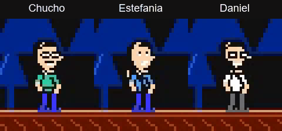
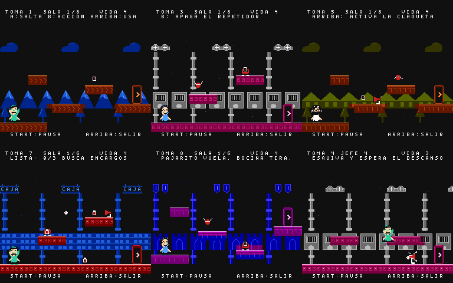

# Una última toma · v0.14.1

Chucho, Estefania y Daniel están buscando una idea para su sketch del videojuego.
Las propuestas de la reunión se convierten en niveles que puedes jugar. Las
interrupciones del grupo cambian el recorrido y cada historia vuelve al estudio
con un remate. Los diálogos son nuevos, no citas del programa.

## Personajes y acciones revisados

La revisión 0.14.1 sustituye las cabezas de retrato reducidas por sprites dibujados
para jugar. Cada personaje tiene 16 poses: reposo y parpadeo, seis pasos de carrera,
ascenso, punto alto del salto, caída, aterrizaje, preparación, acción, recuperación
y daño. Cabeza, torso y pantalones tienen paletas independientes para separar
mejor la silueta del fondo.

Las piernas siguen corriendo o saltando mientras el torso golpea, usa el micrófono
o se protege. El impacto y el disparo coinciden con la acción visible; la
preparación y la recuperación no dañan. Los golpes tienen un alcance cercano a
la mano y Daniel desvía por delante de su defensa. Estefania conserva el golpe
cercano de su micrófono además del proyectil. La protección al entrar en una sala
ya no oculta al personaje; al recibir daño hay una reacción antes del parpadeo.
Los jefes parpadean al recibir un golpe y su aproximación deja espacio para esquivar.

[Vídeo de 32 segundos con las pantallas completas y audio](media/aventura-personajes-v0.14.1.mp4).
El GIF amplía una zona de la captura real; no es una simulación del sprite.

**Estado: en pulido.** Esta pasada atiende personajes, acciones y lectura del
combate. Completar la campaña y pasar pruebas automáticas no certifica que la
presentación, el ritmo o la dificultad estén listos para publicar: falta valorar
estos aspectos jugando y comprobar esta versión físicamente en R36S.

## Campaña completa

| Idea | Lo que se juega | Tomas y salas |
| --- | --- | --- |
| Chucho, bájate de ahí | Plataformas, colchonetas de salto, plataformas móviles y una grúa de rescate demasiado insistente. | 2 × 8 |
| Operación: el estómago | Robots y repetidores del rumor; apaga interruptores con tus ataques y derrota al megáfono. | 2 × 8 |
| El hijo de la chilena | Recorridos con nueve pistas distintas; escoge entre sol, gota y árbol para abrir cada ruta. | 2 × 8 |
| Nadia: la última caja | Capítulo extra: recoge tres encargos por sala y detén el carrito de la caja. | 1 × 6 |
| El castillo de apodos | Capítulo extra: los nombres se vuelven patrullas, bocinas, pájaros y un dragón. | 1 × 6 |
| Ahora sí: el sketch | Una última toma mezcla los tres ambientes principales y resuelve la reunión. | 1 × 6 |

Son **nueve tomas y 66 salas conectadas**, con cinco diseños de jefe y seis
encuentros. Las dos historias extra se abren al completar las tres principales;
no son obligatorias para ver el final. Puedes repetir las tomas desde la mesa.

Antes de cada historia principal hay una preparación corta: dos reparaciones,
doce notas o encontrar a Daniel una vez. Se completa una sola vez por partida.
Tras dos intentos fallidos puedes pedir ayuda con **Select**. La colección original
completa permanece en **Juegos del estudio**, con dos episodios y Remix.

## Controles y personajes

**Izquierda/derecha** mueve; **A** salta. Mantener A permite subir más y soltarlo
produce un salto corto. El motor conserva las pulsaciones cerca del aterrizaje,
al abandonar un borde y durante la pausa breve de un impacto.

**B** usa la habilidad del actor. Chucho golpea cerca; Estefania dispara hacia el
lado que mira; Daniel golpea y puede devolver proyectiles durante su defensa.
Todos pueden rebotar sobre los enemigos al caer sobre ellos. Ninguna ruta exige
un actor específico: los tres pueden completar la campaña y recoger las cintas.

**Arriba** activa una claqueta, abre una pista o cruza la puerta de salida.
Los repetidores también se apagan con ataques. En el supermercado, completa la
lista de tres encargos antes de salir. **Start** abre la pausa con controles,
contraseña, reintento, regreso al estudio y cambio de dificultad.

En la mesa: **arriba/abajo** elige una idea; **izquierda/derecha**, su toma;
**Select** cambia de actor; **A** entra y **Start** muestra la contraseña.

## Reintentos y recompensas

- Normal: cuatro puntos de vida. Ensayo tranquilo: seis, enemigos y jefes más débiles.
- Las claquetas de las salas 1, 3, 5 y 7 recuperan vida. Cada jefe tiene una entrada
  propia para reintentar su combate sin repetir el recorrido anterior.
- Las caídas y derrotas no consumen vidas limitadas. Tras dos derrotas también
  puedes activar la ayuda desde la pantalla de reintento.
- Hay una cinta opcional en la quinta sala de cada toma, salvo el cierre.
  Recogerla la conserva aunque luego falles. Las ocho añaden un remate al final.
- Terminar una toma sin daño y sin asistencia concede una medalla. No bloquea
  contenido y puedes conseguirla al repetir la toma.

Los jefes anuncian su ataque, ejecutan su patrón y descansan: aprovecha el descanso.
Los proyectiles de Estefania y los devueltos por Daniel hacen más daño al jefe,
compensando su menor frecuencia frente a los golpes cercanos.

## Contraseña

Desde la mesa o la pausa, anota los **12 símbolos**. El código conserva las tomas
terminadas, medallas, cintas, ensayos preparados y dificultad. Tras apagar, elige
**Cargar contraseña**: izquierda/derecha cambia de posición; arriba/abajo cambia
el símbolo (puedes mantenerlo); A confirma y B cancela.

La restauración vuelve a la mesa de ideas. No guarda la sala actual, la vida del
personaje ni la colección clásica. Un código incorrecto no modifica el progreso.
La verificación incluye versión, checksum y combinaciones de progreso posibles.
**Nueva aventura** pide confirmación si ya hay progreso; conserva tu código antes
si quieres regresar a esa partida.

## Arte, sonido y alcance

Hay cinco ambientes con arte original, nuevas poses de los tres protagonistas,
cinco jefes dibujados para esta campaña y cinco composiciones nuevas de la APU.
La colección clásica conserva los arreglos cortos existentes. No se incluyen
archivos de audio, grabaciones ni herramientas externas en la distribución.

El [plan inicial](PLAN-AVENTURA.md) propuso 45–75 minutos como meta provisional.
**No es una duración medida ni garantizada**: los recorridos automáticos conocen
las soluciones y no sustituyen una primera partida humana. Se priorizaron salas
cortas, reintentos rápidos y dos capítulos adicionales sobre alargar diálogos.
El motor usa salas fijas conectadas y ocho disposiciones de plataformas combinadas
con enemigos, objetos y reglas de cada mundo; no implementa cámara con desplazamiento.
El estudio es una mesa de selección. Los cameos aparecen en el guion; no hay doblaje.

## Validación y R36S

La batería `python tools/test_all.py --mesen` combina la colección clásica con:

- Recorrido de las 66 salas con cada personaje, las nueve tomas, los ocho objetos
  opcionales y los tres ensayos; solo mediante entradas de mando.
- Comprobaciones de las seis poses de carrera, mezcla de acciones, orientación,
  aterrizaje, visibilidad y sincronización del disparo para los tres actores.
- Pausa de movimiento y música, modo de ayuda, reinicio, contraseñas válidas e
  inválidas, confirmación de nueva partida y regreso al modo clásico.
- Medición durante el recorrido: límite de ocho sprites por línea y menos de 1 %
  de muestras sin actualización de juego, incluyendo transiciones de pantalla.
- Reproducción independiente de la partida completa de Chucho en Mesen,
  comprobando todas las salas y el progreso final.

El [registro de esta entrega](validacion-v0.14.1.json) identifica la ROM por SHA-256.
Los resultados y capturas se generan en `build/`. No se modifica RAM del emulador
para superar niveles ni se usan estados guardados para completar las pruebas.

**La prueba física de v0.14.1 en R36S está pendiente.** La compatibilidad se ha
comprobado en escritorio con FCEUmm y Mesen. En la consola hay que confirmar el
mapeo de A/B, el sonido por altavoz, la lectura de las pistas, la pausa y una carga
de contraseña. La versión concreta de ArkOS/RetroArch puede influir en esos detalles.

Copia `dist/el-cuartico-v0.14.1-mmc5.nes` a la carpeta `nes` de tu tarjeta de juegos.
Arranca la ROM desde cero en NTSC, a velocidad normal y con el control 1.
