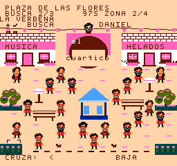
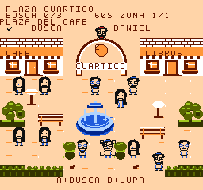

# ¿Dónde está Daniel? — prueba de arte

**v0.10.1**, rama `feature/daniel-art-polish`. El episodio remix aprobado sigue
publicado en `main` como v0.10.0. Esta prueba mantiene sus mecánicas y objetivos.

| Versión aprobada | Nuevo arte de la búsqueda |
| :---: | :---: |
|  |  |

- Figuras propias para la plaza: gafas, peinado, barba, camiseta y pantalones
  más definidos. Los seis rostros siguen siendo diferentes.
- Referencia facial coherente al usar o soltar la lupa.
- Arquitectura con arcos, toldos, ventanas hundidas y detalles en bancos y fuente.
- Colores más cálidos, vegetación menos brillante y jardines que enmarcan la plaza.
- Espacios de personajes despejados y franja de salidas sin obstáculos.

## Probar en Mesen

Abre `dist/el-cuartico-v0.10.1-mmc5.nes` con una partida nueva. Elige Daniel,
recorre las siete áreas de sus tres búsquedas y mantén B sobre una persona para
inspeccionarla. A confirma. No cargues un estado guardado de una versión anterior.

La campaña normal mantiene 12, 32 y 80 personas. Remix mantiene 16, 40 y 96;
los tiempos, objetivos, controles y música se conservan.

Para R36S, copia esta ROM a la carpeta `nes` y ábrela con FCEUmm. Para Retroid,
usa **Cargar contenido** de RetroArch con FCEUmm. Mantén la ROM v0.10.0 si deseas
compararlas. Los controles completos están en el [README](../README.md).

Esta revisión se valida en FCEUmm y Mesen de escritorio; falta probarla en portátil.
