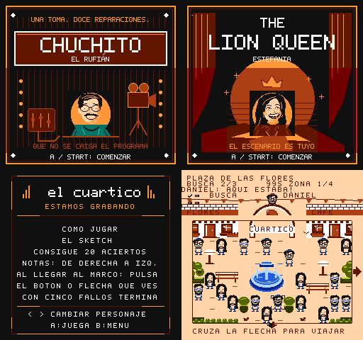
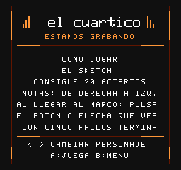
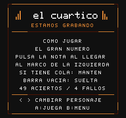
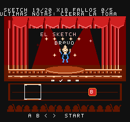

# Entradas y controles · v0.12.1

Esta revisión mejora las entradas de los tres personajes, las instrucciones,
las salidas del mundo de Daniel y el cierre de las rutinas. Conserva los dos
episodios y las seis misiones, con progreso durante la sesión y sin guardado.

## Tres entradas con identidad propia

- **Chuchito el Rufián:** un póster del estudio, con cámara, cables y mezcladora.
- **The Lion Queen:** Estefania entre cortinas, un sol de teatro y una corona.
- **¿Dónde está Dany?:** se conserva la tarjeta inclinada de la búsqueda.

Las tres tarjetas aparecen antes de jugar o reintentar en el primer episodio,
también si eliges desde la ayuda o desde el estudio. **A o Start** confirma;
**B** vuelve al menú. Mantener el botón usado para entrar no se salta la tarjeta.
El reloj y los objetivos esperan. El segundo episodio conserva sus tarjetas de
misión, que explican energía, sostenidas y objetos antes de comenzar.

| Chuchito | Estefania |
| :---: | :---: |
|  |  |

## Ayuda sin parpadeos

Pulsa **arriba** en la selección. Izquierda, derecha o Select cambia de personaje.
Todo el texto cambia a la vez, sin apagar la pantalla ni borrar partes del marco.
Los controles inferiores quedan dentro del borde.

Estefania explica que las notas vienen de la derecha y que debes pulsar el botón
o la dirección que aparece **cuando llegue al marco izquierdo**. La primera A
es una práctica. La rutina pide 20 aciertos en el primer episodio y 49 en el
segundo; el quinto fallo termina el intento. Las notas con cola se mantienen
hasta vaciar su barra.

| Ayuda del primer episodio | Ayuda de sostenidas |
| :---: | :---: |
|  |  |

## Flechas junto a cada salida

El mercado y el barrio tienen franjas despejadas alrededor del escenario.
Una flecha a la izquierda, derecha, arriba o abajo indica una zona conectada
en esa dirección. Lleva el cursor hasta ese borde y sigue pulsando para cruzar.
Suelta B para viajar; mantenerlo sigue sirviendo para la lupa y el movimiento preciso.

Solo aparecen las salidas que existen. El mapa pequeño conserva la zona actual
y las visitadas. Las caras, escondites y objetos mantienen sus posiciones.

## Una pista vacía al cerrar el acto

Cuando ya hay suficientes notas en pantalla para completar el acto, dejan de
aparecer más. Resuelve las que quedan: el último acierto llega sin una nota extra
entrando por el borde. Se conserva la cuenta de cuatro tiempos entre actos.

Si fallas una de las últimas notas, entra una de reemplazo en la cadencia musical.
La rutina termina por aciertos o fallos; no usa cuenta atrás. Las notas sostenidas
también esperan a completarse. Si pausas la última sostenida, al volver aparece
**RETOMA EL BOTÓN PARA SEGUIR**, y su duración y la música esperan a que lo hagas.

## Validación

**779 comprobaciones superadas:** doce suites en FCEUmm y cuatro en Mesen.

Las pruebas usan entradas de control en FCEUmm y Mesen. Comparan cada cuadro de
cambios rápidos de ayuda con una página completa; comprueban 60 Hz, las tres
entradas, sus botones, reinicios, permanencia sin reloj, salidas visibles en todas
las zonas, el último fallo recuperable y la pausa de la última sostenida. La
campaña completa y la restauración exacta de escenarios siguen cubiertas.

El cartucho mantiene 128 KiB PRG y 256 KiB CHR. No se ha probado esta entrega en
una R36S física; las capturas corresponden a los emuladores de escritorio.

Para probarla, descarga la ROM actual desde el README, inicia sin un estado de
una versión anterior, abre la ayuda con arriba y cambia varias veces de personaje.
Después visita las tres tarjetas y busca a Daniel hasta llegar al barrio.
