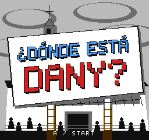

# Intro de Dany y retratos

Propuesta v0.10.2 en `feature/dany-intro-portraits`, para revisar mediante PR.

## ¿Dónde está Dany?

La tarjeta recrea la composición de la imagen aportada: cartel blanco inclinado,
«¿DÓNDE ESTÁ» azul, «DANY?» rojo y una iglesia con cielo nublado al fondo.
Es arte nuevo por tiles, adaptado a la resolución y paletas de NES.

A o Start comienza la búsqueda. B vuelve al menú. El reloj no avanza mientras
se muestra la tarjeta, y mantener el botón de selección no la salta automáticamente.
La intro también aparece al reintentar; las búsquedas siguientes pasan directamente
al siguiente mundo.

## Retratos del menú

| Antes | Propuesta |
| :---: | :---: |
|  |  |

- **Chucho:** gafas finas redondas, bigote, cabello de lado y camiseta verde.
- **Estefania:** raya lateral, cabello largo, ojos almendrados y chaqueta de denim.
- **Daniel:** montura más gruesa, cabello con volumen, barba completa y camiseta blanca.

Los retratos toman como referencia la fotografía grupal compartida por el usuario.
Browser no pudo iniciarse durante esta revisión; no se utilizaron fotos nuevas de
internet. Los sprites de las partidas y la lupa conservan su propio arte.

## Probar

Abre `dist/el-cuartico-v0.10.2-mmc5.nes` en Mesen o FCEUmm e inicia una partida nueva.
Cambia varias veces de personaje en el menú, elige Daniel y comprueba A/Start y B
en la tarjeta. Puedes dejarla abierta: tendrás los 60 segundos al comenzar la plaza.

La prueba cubre ambas campañas y los seis órdenes de personajes en FCEUmm, además
de una campaña independiente en Mesen. Aún falta probar esta versión en R36S/Retroid.
