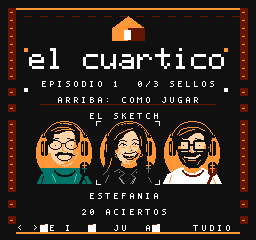

# Texto compacto para R36S · v0.12.2

Las fotos del usuario confirman que v0.12.1 arranca en su R36S y muestran texto
muy dominante en el menú de personajes y en la ayuda. Esta revisión reduce la
letra de esas pantallas y de las tarjetas compartidas de pausa, resultados y
misiones del segundo episodio.

La fuente anterior tenía letras de 5 × 7 píxeles. La nueva usa principalmente
4 × 6, con cinco columnas para letras que necesitan más anchura, como M y W.
Los trazos siguen teniendo un píxel; las letras quedan centradas en las mismas
casillas de 8 × 8, con margen arriba y abajo. Las instrucciones conservan sus
filas y no cambian los controles ni el funcionamiento del cambio de personaje.

La ayuda del sketch presenta el momento y la acción en dos líneas:
«AL LLEGAR AL MARCO:» y «PULSA SU BOTON O FLECHA». También abrevia el sentido
de las notas y deja explícito que el quinto fallo termina el intento.

| Menú | Ayuda de Estefania |
| --- | --- |
|  |  |

Son capturas reales de la ROM en FCEUmm. Los logos, retratos, tarjetas ilustradas
y símbolos de botones conservan su diseño; el HUD durante el juego usa su fuente
anterior. El cambio se centra en las pantallas antiguas señaladas en las fotos.

## Comprobación

La entrega anterior se vio funcionando en la R36S del usuario. La legibilidad de
esta nueva fuente requiere volver a comprobarla en esa consola; estas capturas
no simulan su filtro ni su escalado.

La ROM v0.12.2 supera **779 comprobaciones** en doce suites FCEUmm y cuatro
Mesen: ambas campañas, ayuda sin parpadeos a 60 Hz, pausa, resultados y reinicios.
La compilación final coincide byte a byte con la ROM probada.
