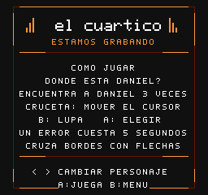
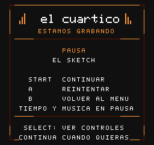
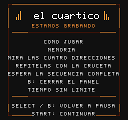
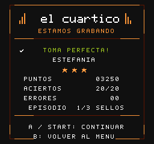
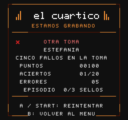

# Presentación v0.11.0

Esta edición añade una presentación común para entender, pausar y terminar
los tres juegos. La ROM conserva el tamaño y las reglas del episodio remix.

## Elegir y aprender

| Selección | Ayuda de Daniel |
| :---: | :---: |
|  |  |

[Controles de Chucho](media/ayuda-chucho.png) · [Controles de Estefania](media/ayuda-estefania.png).

El menú muestra los sellos obtenidos. Pulsa **arriba** para consultar el objetivo
y los controles; **izquierda/derecha** cambia de personaje, **A/Start** juega y
**B** vuelve. La ayuda es opcional y respeta los personajes que ya tienen sello.

Al acercarte a una estación averiada, Chucho indica su acción. El sketch distingue
la práctica y la cuenta de entrada en la franja superior. La selección tiene un
sonido breve propio, diferente del de un acierto.

## Una pausa completa

| Pausa | Controles del puzle activo |
| :---: | :---: |
|  |  |

**Start** abre la pausa y vuelve al juego. **A** reintenta y **B** regresa al menú.
**Select** muestra los controles del juego actual; dentro de una reparación,
explica ese puzle. Desde los controles, **Select/B** vuelve a la pausa y **Start**
continúa directamente.

El reloj, los plazos de las averías, el puzle y la música esperan mientras lees.
Al continuar vuelven la misma escena y sus colores. La plaza y las personas
permanecen donde estaban, incluso en los distritos conectados de Daniel.

## Resultados del intento

| Toma perfecta | Volver a intentarlo |
| :---: | :---: |
|  |  |

La tarjeta muestra puntos, avance del objetivo, errores, medallas y sellos del
episodio. Las derrotas explican si se agotó el tiempo, faltaron corazones o se
acumularon cinco fallos musicales. Las medallas y los puntos de campaña se
conceden con las mismas reglas de la versión anterior.

## Probar en la consola

Usa [el-cuartico-v0.11.0-mmc5.nes](../dist/el-cuartico-v0.11.0-mmc5.nes?raw=1)
y comienza desde cero, sin cargar un estado guardado de otra versión.

1. Consulta la ayuda de los tres personajes desde el menú.
2. Abre un panel de Chucho, pausa, consulta sus controles y continúa el puzle.
3. Pausa el sketch durante una cuenta de entrada y comprueba la reanudación.
4. Pausa a Daniel en otra zona y comprueba que conserva las personas y la paleta.
5. Revisa una victoria y una derrota, y continúa el episodio desde los resultados.

La validación automatizada reúne **572 comprobaciones**: diez suites en FCEUmm,
una campaña independiente en Mesen y una suite de restauración de imagen en
Mesen. Esta última compara los 1024 bytes de la tabla de nombres y atributos,
y las 32 entradas de paleta antes y después de pausar. La ROM conserva
**393232 bytes**, 128 KiB de PRG y 256 KiB de CHR. Falta la prueba de v0.11.0 en R36S.
