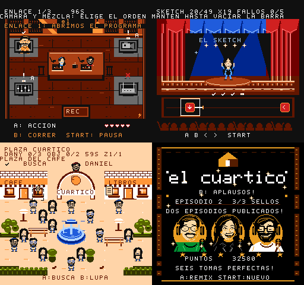
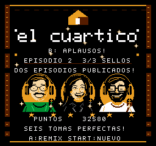

# Episodio 2: En directo · v0.12.0

La campaña tiene dos episodios y seis misiones. Tras ganar los tres juegos de la
primera grabación, pulsa **A** para continuar al directo. Conservas los puntos y
las medallas del episodio anterior; puedes elegir el orden de las tres misiones
nuevas. El avance permanece en la sesión. No se añade guardado.

## Chucho: Salvemos el directo

Prepara **tres enlaces**, con cuatro reparaciones en cada uno:

1. Restaura la **energía** en los cables, arriba a la izquierda.
2. Arregla **cámara y mezcladora**, en el orden que prefieras.
3. Reinicia la señal en **memoria** para cerrar el enlace.

Las cruces marcan sistemas bloqueados y las marcas de acierto, los que ya
reparaste. La energía abre dos opciones; completar ambas habilita la transmisión.
Si vence una avería pierdes un corazón, pero puedes volver a repararla. El reloj
y todos los plazos siguen parados mientras tienes un panel abierto.

## Estefania: El gran número

La nueva rutina tiene **49 aciertos**, incluida la práctica, tres composiciones
nuevas y cambios de acto al llegar a 17 y 33 aciertos. Conserva la tolerancia de
cuatro fallos; el quinto termina el intento.

Las notas normales se pulsan como antes. Cuando una nota tiene cola, empieza a
mantener su botón dentro del recuadro y suéltalo al terminar la barra. Soltar antes
cuenta como un fallo. Las otras notas y la música siguen su recorrido durante
la sostenida.

Puedes pausar y consultar los controles. Al volver de una sostenida, el juego
espera a que retomes su botón; la música y la nota conservan el punto exacto.

## Daniel: Dany llega tarde

Encuentra a Daniel en plaza, mercado y barrio, con 16, 40 y 96 personas repartidas
entre una, dos y cuatro zonas. Hay **dos objetos opcionales por mundo**: micrófono
y guion. Acércate y pulsa **A** para recogerlos.

Cada objeto da **150 puntos**, hasta **diez segundos** y una pista: el lado de la
plaza o el número de la zona de Daniel. El reloj tiene un máximo de 99 segundos.
El HUD muestra los objetos del mundo actual; el resultado reúne los seis de la
misión. Los objetos recogidos permanecen fuera del mapa cuando vuelves a su zona.

La lupa sigue identificando la persona que seleccionará A. Puedes completar los
tres encuentros sin recoger objetos y conservar una medalla perfecta.

## Cierre y Remix

Al completar las seis misiones cierras ambos episodios y desbloqueas Remix.
Seis tomas perfectas tienen su reconocimiento en el final.

- **A después del episodio 1:** continúa al episodio 2.
- **A después del episodio 2:** empieza Remix desde el primer episodio.
- **Start en cualquiera de los cierres:** empieza una campaña normal.
- **B en los cierres:** anima la fiesta.

## Validación

**680 comprobaciones superadas:** once suites en FCEUmm y tres en Mesen.

La entrega conserva el cartucho MMC5 de 128 KiB PRG y 256 KiB CHR, sin batería.
La validación de escritorio usa controles reales de emulador; no modifica RAM
ni carga estados para saltarse la campaña. Los informes locales están en `build/`.

Se comprueban el avance entre episodios, el orden de reparaciones, las notas
sostenidas, la pausa y recuperación, la música, los objetos opcionales, las
visitas repetidas, las medallas y una campaña Remix completa. Mesen compara además
el fondo y la paleta al volver de pausa y ayuda.

La prueba en R36S de esta versión sigue pendiente. Las capturas corresponden a
FCEUmm y Mesen de escritorio. No se fija todavía una duración de campaña:
conviene medirla con personas que jueguen por primera vez.
